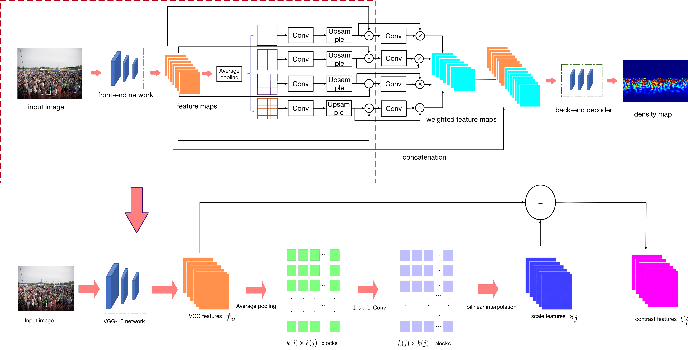
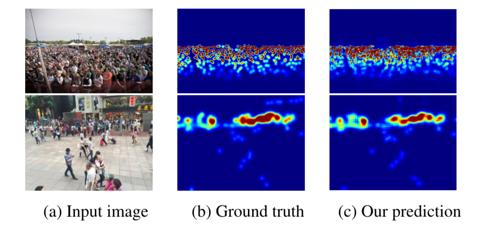

# Context-Aware Crowd Counting

This repository is a PyTorch implementation for the paper **Context-Aware Crowd Counting**. Weizhe Liu, Mathieu Salzmann, Pascal Fua. CVPR. 2019. If you use this code in your research, please cite
[the paper](http://openaccess.thecvf.com/content_CVPR_2019/papers/Liu_Context-Aware_Crowd_Counting_CVPR_2019_paper.pdf).

State-of-the-art methods for counting people in crowded scenes rely on deep networks to estimate crowd density. They typically use the same filters over the whole image or over large image patches. Only then do they estimate local scale to compensate for perspective distortion. This is typically achieved by training an auxiliary classifier to select, for predefined image patches, the best kernel size among a limited set of choices. As such, these methods are not endto-end trainable and restricted in the scope of context they can leverage.

In this paper, we introduce an end-to-end trainable deep architecture that combines features obtained using multiple receptive field sizes and learns the importance of each such feature at each image location. In other words, our approach adaptively encodes the scale of the contextual information required to accurately predict crowd density. This yields an algorithm that outperforms state-of-the-art crowd counting methods, especially when perspective effects are strong.


Figure 1: Context-Aware Network. (Top) RGB images are fed to a font-end network that comprises the first 10 layers of the VGG-16
network. The resulting local features are grouped in blocks of different sizes by average pooling followed by a 1×1 convolutional layer.
They are then up-sampled back to the original feature size to form the contrast features. Contrast features are further used to learn the
weights for the scale-aware features that are then fed to a back-end network to produce the final density map. (Bottom) As shown in this
expanded version of the first part of the network, the contrast features are the difference between local features and context features.



Figure 2: Crowd density estimation on ShanghaiTech. First
row: Image from Part A. Second row: Image from Part B. Our
model adjusts to rapid scale changes and delivers density maps
that are close to the ground truth.

## Installation
PyTorch 0.4.1

Python 2.7

## Dataset

&emsp;1. Download ShanghaiTech Part B Dataset from
Dropbox: [link](https://www.dropbox.com/s/fipgjqxl7uj8hd5/ShanghaiTech.zip?dl=0) or Baidu Disk: [link](http://pan.baidu.com/s/1nuAYslz).  

&emsp;2. Create the hdf5 files with make_dataset.py, you need to set the path according to dataset location.

&emsp;3. Use create_json.py to generate the json file which contains the path to the images.

## Training
In command line:

```
python train.py train.json val.json

``` 

The json files here are generated from previous step (Dataset. 3.)

## Tesing
&emsp;1. Modify the "test.py", make sure the path is correct.

&emsp;2. In command line:

```
python test.py

``` 

## Venice Dataset
The dataset is in [GoogleDrive](https://drive.google.com/file/d/15PUf7C3majy-BbWJSSHaXUlot0SUh3mJ/view).

## Notes

&emsp;1. This is the implementation for ShanghaiTech part B, the pretrained model is in [GoogleDrive](https://drive.google.com/file/d/1meuY_nfcABvsPFG1rXZEpAxcjnk0L9M1/view?usp=sharing) with MAE=7.5


&emsp;2. For ShanghaiTech Part A, refer to [this](https://github.com/CommissarMa/Context-Aware_Crowd_Counting-pytorch), thanks [CommissarMa](https://github.com/CommissarMa) for this implementation.

 &emsp;3. For some dataset which training images have different size, we set batch size to 1, like ShanghaiTech part A. For others, you could set your batch size according to you GPU memory, but the batch size may affect your model accuracy during training.

 &emsp;4. For the selection of train/val dataset, we follow the same setting as previous work, you could find it [here](https://github.com/leeyeehoo/CSRNet-pytorch)
 
## Citing

``` 

@InProceedings{Liu_2019_CVPR,

author = {Liu, Weizhe and Salzmann, Mathieu and Fua, Pascal},

title = {Context-Aware Crowd Counting},

booktitle = {The IEEE Conference on Computer Vision and Pattern Recognition (CVPR)},

month = {June},

year = {2019}

}

``` 

``` 
@InProceedings{Liu_2019_IROS,

author = {Liu, Weizhe and Lis, Krzysztof Maciej and Salzmann, Mathieu and Fua, Pascal},

title = {Geometric and Physical Constraints for Drone-Based Head Plane Crowd Density Estimation},

booktitle = {IEEE/RSJ International Conference on Intelligent Robots and Systems (IROS)},

month = {November},

year = {2019}

}

``` 

## Contact

For any questions regard this paper/code, please directly contact [Weizhe Liu](mailto:weizhe.liu@epfl.ch).

